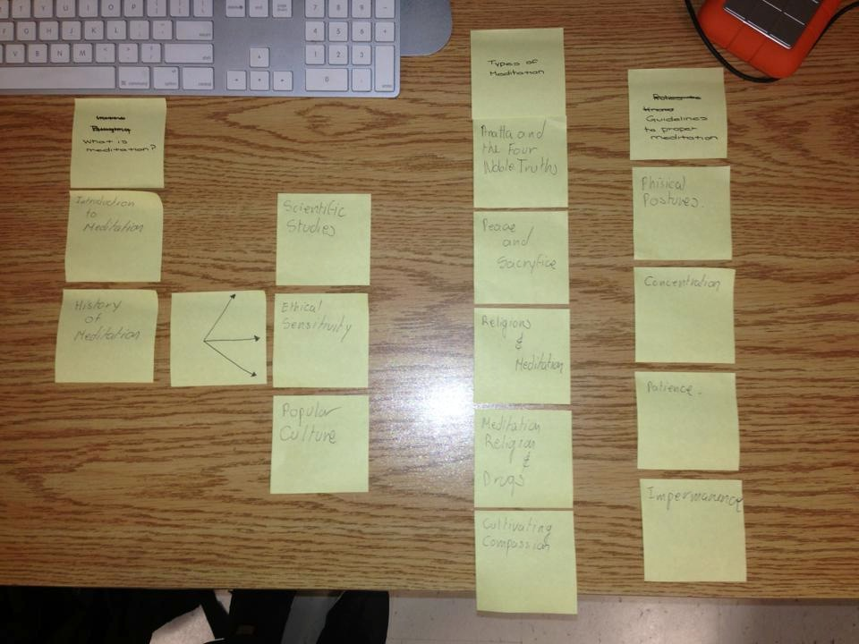

# Card sort report

The purpose of this card sort was to determine common navigation patterns and categories to arrange the content of my Meditation Fundamentals large data-oriented website.

## Specifics

The card sort was conducted by Alejandro Andrade on Thursday, September 3rd, 2013, between the times of 3 pm and 6 pm with the following participants:

- Jessica Hay
- Nick Appolon

### Cards

18 cards were used covering a broad range of applicable content for the website. The following topics were used as cards:

1. What is Medition?
2. Introduction to Meditaton
3. History of Meditation
4. Scientific Studies 
5. Popular Colture 
6. etc.

## Card sort results

*Card sort 1 by Jessica Hay*

*Card sort 2 by Nick Appolon*

## Observations

- Did the participants have any common comments?
  - they were a little confused with the topics.
- Did they have questions that stood out?
	- there were a couple of titles that used complicated words. 
- Did they struggle with certain articles or topics?
- 	- Yes, a bit with unknown terms
- Did they find common groupings? Or were the groupings completely different?
	- he groupings were kind of similar
- Were some of the groupings completely unexpected?
	- yes, one of them was better than the one I organized.
- Were the results similar to your expectations?
	- yes, I liked the organization
- How did you feel while watching them perform the task?	- I felt that sometimes we can miss things other people can see, so its good to always have a second opinion when it gets to organization